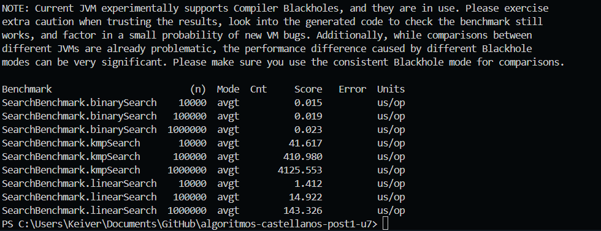
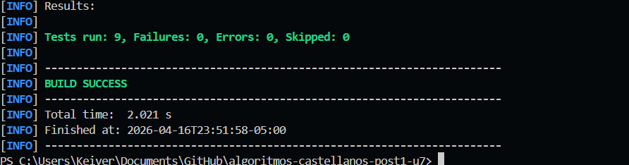

# algoritmos-castellanos-post1-u7

Actividad Post-Contenido 1 - Unidad 7
Diseno de Algoritmos y Sistemas - UDES (2026)

## Objetivo

Implementar en Java 17+ algoritmos de busqueda y recuperacion de informacion:

- Variantes robustas de busqueda binaria (`lowerBound`, `upperBound`, `countOccurrences`, `bisectAnswer`).
- KMP (funcion de fallo + busqueda de ocurrencias).
- Suffix Array (construccion por comparacion + LCP de Kasai + consulta de patron).
- Benchmark JMH para comparar busqueda lineal, binaria y KMP.

## Estructura del proyecto

```text
algoritmos-castellanos-post1-u7/
├─ pom.xml
├─ README.md
├─ capturas/
│  ├─ benchmark.png
│  └─ test.png
└─ src/
	├─ main/java/search/
	│  ├─ BinarySearch.java
	│  ├─ KMP.java
	│  ├─ SuffixArray.java
	│  └─ SearchBenchmark.java
	└─ test/java/search/
		├─ BinarySearchTest.java
		├─ KMPTest.java
		└─ SuffixArrayTest.java
```

Archivos clave:

- [pom.xml](pom.xml): configuracion Maven, JUnit y JMH.
- [src/main/java/search/BinarySearch.java](src/main/java/search/BinarySearch.java): variantes de busqueda binaria y busqueda sobre respuesta.
- [src/main/java/search/KMP.java](src/main/java/search/KMP.java): funcion de fallo y busqueda de patrones.
- [src/main/java/search/SuffixArray.java](src/main/java/search/SuffixArray.java): construccion de suffix array, LCP y consulta.
- [src/main/java/search/SearchBenchmark.java](src/main/java/search/SearchBenchmark.java): benchmark comparativo JMH.
- [src/test/java/search/BinarySearchTest.java](src/test/java/search/BinarySearchTest.java): checkpoints de busqueda binaria.
- [src/test/java/search/KMPTest.java](src/test/java/search/KMPTest.java): checkpoints de KMP.
- [src/test/java/search/SuffixArrayTest.java](src/test/java/search/SuffixArrayTest.java): checkpoints de suffix array.

## Complejidades teoricas

### BinarySearch

- `lowerBound`: O(log n) tiempo, O(1) espacio.
- `upperBound`: O(log n) tiempo, O(1) espacio.
- `countOccurrences`: O(log n) tiempo, O(1) espacio.
- `bisectAnswer`: O(log(hi-lo+1)) llamadas al predicado, O(1) espacio.

### KMP

- `buildFailure`: O(m) tiempo, O(m) espacio.
- `search`: O(n + m) tiempo, O(m) espacio.

### SuffixArray

- Construccion por comparacion de sufijos: O(n log^2 n) (como exige la guia).
- `buildLCP` (Kasai): O(n) tiempo, O(n) espacio auxiliar.
- `contains`: O(m log n) tiempo (comparacion por prefijo), O(1) espacio extra.

## Checkpoints verificados por tests

Ejecutar:

```bash
mvn test
```

Cobertura de checkpoints y casos borde en:

- [src/test/java/search/BinarySearchTest.java](src/test/java/search/BinarySearchTest.java)
- [src/test/java/search/KMPTest.java](src/test/java/search/KMPTest.java)
- [src/test/java/search/SuffixArrayTest.java](src/test/java/search/SuffixArrayTest.java)

Notas de consistencia respecto al PDF:

- En el caso de asignacion de tareas `[3,5,2,8,4]` con `k=3`, la carga minima correcta es `10`.
- Para `KMP.search("AABAABAABAAB", "AABA")`, las ocurrencias correctas son `[0, 3, 6]`.

## Benchmark JMH

Comando usado para la captura del benchmark incluida en este README:

```bash
mvn -q -DskipTests org.codehaus.mojo:exec-maven-plugin:3.5.0:java "-Dexec.mainClass=org.openjdk.jmh.Main" "-Dexec.args=search.SearchBenchmark -wi 1 -i 1 -f 0 -r 200ms -w 200ms"
```

### Resultados (Average Time, us/op)

| Algoritmo    | n=10000 | n=100000 | n=1000000 |
| ------------ | ------: | -------: | --------: |
| linearSearch |   1.412 |   14.922 |   143.326 |
| binarySearch |   0.015 |    0.019 |     0.023 |
| kmpSearch    |  41.617 |  410.980 |  4125.553 |

Evidencia:



### Analisis breve

- `binarySearch` escala logaritmicamente y se mantiene casi constante al crecer `n`.
- `linearSearch` crece aproximadamente lineal con `n`.
- `kmpSearch` tambien crece lineal en este experimento porque el texto aumenta y el patron no aparece.
- El analisis anterior coincide con la captura: al aumentar `n`, lineal y KMP crecen de forma proporcional, mientras binaria cambia de forma minima.

## Capturas

- Captura de pruebas exitosas:



- Captura de benchmark:


Carpeta de evidencias: [capturas](capturas).
